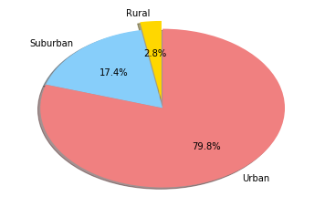

```python

import pandas as pd

import matplotlib.pyplot as plt

import seaborn as sns
```


```python
file_input_city_csv = "generated_data/city_data.csv"
file_input_rides_csv = "generated_data/ride_data.csv"
```


```python

city_df = pd.read_csv(file_input_city_csv)
city_df.head()

```


<div>
<style scoped>
    .dataframe tbody tr th:only-of-type {
        vertical-align: middle;
    }

    .dataframe tbody tr th {
        vertical-align: top;
    }

    .dataframe thead th {
        text-align: right;
    }
</style>
<table border="1" class="dataframe">
  <thead>
    <tr style="text-align: right;">
      <th></th>
      <th>city</th>
      <th>driver_count</th>
      <th>type</th>
    </tr>
  </thead>
  <tbody>
    <tr>
      <th>0</th>
      <td>Lake Ambermouth</td>
      <td>29</td>
      <td>Urban</td>
    </tr>
    <tr>
      <th>1</th>
      <td>Danielton</td>
      <td>5</td>
      <td>Urban</td>
    </tr>
    <tr>
      <th>2</th>
      <td>Nicholasshire</td>
      <td>18</td>
      <td>Urban</td>
    </tr>
    <tr>
      <th>3</th>
      <td>Owensburgh</td>
      <td>55</td>
      <td>Urban</td>
    </tr>
    <tr>
      <th>4</th>
      <td>New Alexandrastad</td>
      <td>5</td>
      <td>Urban</td>
    </tr>
  </tbody>
</table>
</div>


```python
rides_df = pd.read_csv(file_input_rides_csv)
rides_df.head()
```


<div>
<style scoped>
    .dataframe tbody tr th:only-of-type {
        vertical-align: middle;
    }

    .dataframe tbody tr th {
        vertical-align: top;
    }

    .dataframe thead th {
        text-align: right;
    }
</style>
<table border="1" class="dataframe">
  <thead>
    <tr style="text-align: right;">
      <th></th>
      <th>city</th>
      <th>date</th>
      <th>fare</th>
      <th>ride_id</th>
    </tr>
  </thead>
  <tbody>
    <tr>
      <th>0</th>
      <td>Moralesmouth</td>
      <td>2018-02-18 08:26:55</td>
      <td>16.92</td>
      <td>809189561605</td>
    </tr>
    <tr>
      <th>1</th>
      <td>South Douglasport</td>
      <td>2018-02-14 17:35:55</td>
      <td>24.01</td>
      <td>185005986938</td>
    </tr>
    <tr>
      <th>2</th>
      <td>Roseshire</td>
      <td>2018-01-14 14:08:37</td>
      <td>9.14</td>
      <td>6116304082209</td>
    </tr>
    <tr>
      <th>3</th>
      <td>Meyerstad</td>
      <td>2018-01-24 19:15:23</td>
      <td>11.46</td>
      <td>2313840895285</td>
    </tr>
    <tr>
      <th>4</th>
      <td>Laurafort</td>
      <td>2018-01-18 07:56:00</td>
      <td>34.91</td>
      <td>7956887386900</td>
    </tr>
  </tbody>
</table>
</div>


```python
group_by_city_rides_df = rides_df.groupby('city')

```


```python
rides_count_per_city = group_by_city_rides_df.ride_id.count()
rides_count_per_city.head()
```


    city
    Alanton        8
    Alicemouth    17
    Annshire      26
    Arthurland    19
    Berryland     28
    Name: ride_id, dtype: int64


```python
avg_fare_per_city = group_by_city_rides_df.fare.mean()
avg_fare_per_city.head()
```


    city
    Alanton       31.313750
    Alicemouth    28.145882
    Annshire      23.280769
    Arthurland    31.851579
    Berryland     25.701071
    Name: fare, dtype: float64


```python
second_city_df = pd.concat((rides_count_per_city,avg_fare_per_city),axis=1)
second_city_df = second_city_df.rename(columns={'ride_id':'ride_count','fare':'avg_fare'})
second_city_df.head()
```


<div>
<style scoped>
    .dataframe tbody tr th:only-of-type {
        vertical-align: middle;
    }

    .dataframe tbody tr th {
        vertical-align: top;
    }

    .dataframe thead th {
        text-align: right;
    }
</style>
<table border="1" class="dataframe">
  <thead>
    <tr style="text-align: right;">
      <th></th>
      <th>ride_count</th>
      <th>avg_fare</th>
    </tr>
    <tr>
      <th>city</th>
      <th></th>
      <th></th>
    </tr>
  </thead>
  <tbody>
    <tr>
      <th>Alanton</th>
      <td>8</td>
      <td>31.313750</td>
    </tr>
    <tr>
      <th>Alicemouth</th>
      <td>17</td>
      <td>28.145882</td>
    </tr>
    <tr>
      <th>Annshire</th>
      <td>26</td>
      <td>23.280769</td>
    </tr>
    <tr>
      <th>Arthurland</th>
      <td>19</td>
      <td>31.851579</td>
    </tr>
    <tr>
      <th>Berryland</th>
      <td>28</td>
      <td>25.701071</td>
    </tr>
  </tbody>
</table>
</div>


```python
second_city_df = second_city_df.reset_index()
second_city_df.head()
```


<div>
<style scoped>
    .dataframe tbody tr th:only-of-type {
        vertical-align: middle;
    }

    .dataframe tbody tr th {
        vertical-align: top;
    }

    .dataframe thead th {
        text-align: right;
    }
</style>
<table border="1" class="dataframe">
  <thead>
    <tr style="text-align: right;">
      <th></th>
      <th>city</th>
      <th>ride_count</th>
      <th>avg_fare</th>
    </tr>
  </thead>
  <tbody>
    <tr>
      <th>0</th>
      <td>Alanton</td>
      <td>8</td>
      <td>31.313750</td>
    </tr>
    <tr>
      <th>1</th>
      <td>Alicemouth</td>
      <td>17</td>
      <td>28.145882</td>
    </tr>
    <tr>
      <th>2</th>
      <td>Annshire</td>
      <td>26</td>
      <td>23.280769</td>
    </tr>
    <tr>
      <th>3</th>
      <td>Arthurland</td>
      <td>19</td>
      <td>31.851579</td>
    </tr>
    <tr>
      <th>4</th>
      <td>Berryland</td>
      <td>28</td>
      <td>25.701071</td>
    </tr>
  </tbody>
</table>
</div>


```python
final_df = pd.merge(city_df,second_city_df,how='inner')
final_df.head()
```


<div>
<style scoped>
    .dataframe tbody tr th:only-of-type {
        vertical-align: middle;
    }

    .dataframe tbody tr th {
        vertical-align: top;
    }

    .dataframe thead th {
        text-align: right;
    }
</style>
<table border="1" class="dataframe">
  <thead>
    <tr style="text-align: right;">
      <th></th>
      <th>city</th>
      <th>driver_count</th>
      <th>type</th>
      <th>ride_count</th>
      <th>avg_fare</th>
    </tr>
  </thead>
  <tbody>
    <tr>
      <th>0</th>
      <td>Lake Ambermouth</td>
      <td>29</td>
      <td>Urban</td>
      <td>28</td>
      <td>22.513929</td>
    </tr>
    <tr>
      <th>1</th>
      <td>Danielton</td>
      <td>5</td>
      <td>Urban</td>
      <td>27</td>
      <td>24.950741</td>
    </tr>
    <tr>
      <th>2</th>
      <td>Nicholasshire</td>
      <td>18</td>
      <td>Urban</td>
      <td>21</td>
      <td>21.321429</td>
    </tr>
    <tr>
      <th>3</th>
      <td>Owensburgh</td>
      <td>55</td>
      <td>Urban</td>
      <td>23</td>
      <td>23.117391</td>
    </tr>
    <tr>
      <th>4</th>
      <td>New Alexandrastad</td>
      <td>5</td>
      <td>Urban</td>
      <td>25</td>
      <td>26.236000</td>
    </tr>
  </tbody>
</table>
</div>


```python
color_labels = final_df['type'].unique()
# List of RGB triplets
rgb_values = sns.color_palette("Set1", 3)
# Map label to RGB
color_map = dict(zip(color_labels, rgb_values))

final_df.plot.scatter(x='ride_count',y='avg_fare',s=final_df['driver_count'], 
                      c=final_df['type'].map(color_map),alpha=0.4,edgecolors='grey',
                      linewidth=2,figsize=(20,10),label=final_df['type'].unique())

# Add titles (main and on axis)
plt.xlabel("Total Number of Rides (Per City)")
plt.ylabel("Average Fare($)")
plt.title("Pyber Ride Sharing Data(2016)")

plt.legend(loc="upper right", fancybox=True)

plt.show()

```


```python
final_df.head()
```


<div>
<style scoped>
    .dataframe tbody tr th:only-of-type {
        vertical-align: middle;
    }

    .dataframe tbody tr th {
        vertical-align: top;
    }

    .dataframe thead th {
        text-align: right;
    }
</style>
<table border="1" class="dataframe">
  <thead>
    <tr style="text-align: right;">
      <th></th>
      <th>city</th>
      <th>driver_count</th>
      <th>type</th>
      <th>ride_count</th>
      <th>avg_fare</th>
    </tr>
  </thead>
  <tbody>
    <tr>
      <th>0</th>
      <td>Lake Ambermouth</td>
      <td>29</td>
      <td>Urban</td>
      <td>28</td>
      <td>22.513929</td>
    </tr>
    <tr>
      <th>1</th>
      <td>Danielton</td>
      <td>5</td>
      <td>Urban</td>
      <td>27</td>
      <td>24.950741</td>
    </tr>
    <tr>
      <th>2</th>
      <td>Nicholasshire</td>
      <td>18</td>
      <td>Urban</td>
      <td>21</td>
      <td>21.321429</td>
    </tr>
    <tr>
      <th>3</th>
      <td>Owensburgh</td>
      <td>55</td>
      <td>Urban</td>
      <td>23</td>
      <td>23.117391</td>
    </tr>
    <tr>
      <th>4</th>
      <td>New Alexandrastad</td>
      <td>5</td>
      <td>Urban</td>
      <td>25</td>
      <td>26.236000</td>
    </tr>
  </tbody>
</table>
</div>


```python
final_df['total_fare'] = final_df['ride_count']*final_df['avg_fare']
final_df.head()
```


<div>
<style scoped>
    .dataframe tbody tr th:only-of-type {
        vertical-align: middle;
    }

    .dataframe tbody tr th {
        vertical-align: top;
    }

    .dataframe thead th {
        text-align: right;
    }
</style>
<table border="1" class="dataframe">
  <thead>
    <tr style="text-align: right;">
      <th></th>
      <th>city</th>
      <th>driver_count</th>
      <th>type</th>
      <th>ride_count</th>
      <th>avg_fare</th>
      <th>total_fare</th>
    </tr>
  </thead>
  <tbody>
    <tr>
      <th>0</th>
      <td>Lake Ambermouth</td>
      <td>29</td>
      <td>Urban</td>
      <td>28</td>
      <td>22.513929</td>
      <td>630.39</td>
    </tr>
    <tr>
      <th>1</th>
      <td>Danielton</td>
      <td>5</td>
      <td>Urban</td>
      <td>27</td>
      <td>24.950741</td>
      <td>673.67</td>
    </tr>
    <tr>
      <th>2</th>
      <td>Nicholasshire</td>
      <td>18</td>
      <td>Urban</td>
      <td>21</td>
      <td>21.321429</td>
      <td>447.75</td>
    </tr>
    <tr>
      <th>3</th>
      <td>Owensburgh</td>
      <td>55</td>
      <td>Urban</td>
      <td>23</td>
      <td>23.117391</td>
      <td>531.70</td>
    </tr>
    <tr>
      <th>4</th>
      <td>New Alexandrastad</td>
      <td>5</td>
      <td>Urban</td>
      <td>25</td>
      <td>26.236000</td>
      <td>655.90</td>
    </tr>
  </tbody>
</table>
</div>


```python
total_fare_per_city_type = final_df.groupby('type').total_fare.sum()
total_fare_per_city_type
```


    type
    Rural        4450.07
    Suburban    19689.77
    Urban       40785.84
    Name: total_fare, dtype: float64


```python
labels = ["Rural", "Suburban", "Urban"]
sizes = total_fare_per_city_type
colors = ["Gold", "lightskyBlue", "lightCoral"]
explode = (0.1, 0, 0)
plt.pie(sizes,explode=explode,labels=labels,colors=colors,autopct="%1.1f%%", shadow=True, startangle=90)
plt.show()
```


```python
total_ride_per_city_type = final_df.groupby('type').ride_count.sum()
total_ride_per_city_type
```


    type
    Rural        125
    Suburban     651
    Urban       1637
    Name: ride_count, dtype: int64


```python
labels = ["Rural", "Suburban", "Urban"]
sizes = total_ride_per_city_type
colors = ["Gold", "lightskyBlue", "lightCoral"]
explode = (0.1, 0, 0)
plt.pie(sizes,explode=explode,labels=labels,colors=colors,autopct="%1.1f%%", shadow=True, startangle=90)
plt.show()
```


```python
total_driver_per_city_type = final_df.groupby('type').driver_count.sum()
total_driver_per_city_type
```


    type
    Rural         85
    Suburban     524
    Urban       2405
    Name: driver_count, dtype: int64


```python
labels = ["Rural", "Suburban", "Urban"]
sizes = total_driver_per_city_type
colors = ["Gold", "lightskyBlue", "lightCoral"]
explode = (0.1, 0, 0)
plt.pie(sizes,explode=explode,labels=labels,colors=colors,autopct="%1.1f%%", shadow=True, startangle=90)
plt.show()
```




